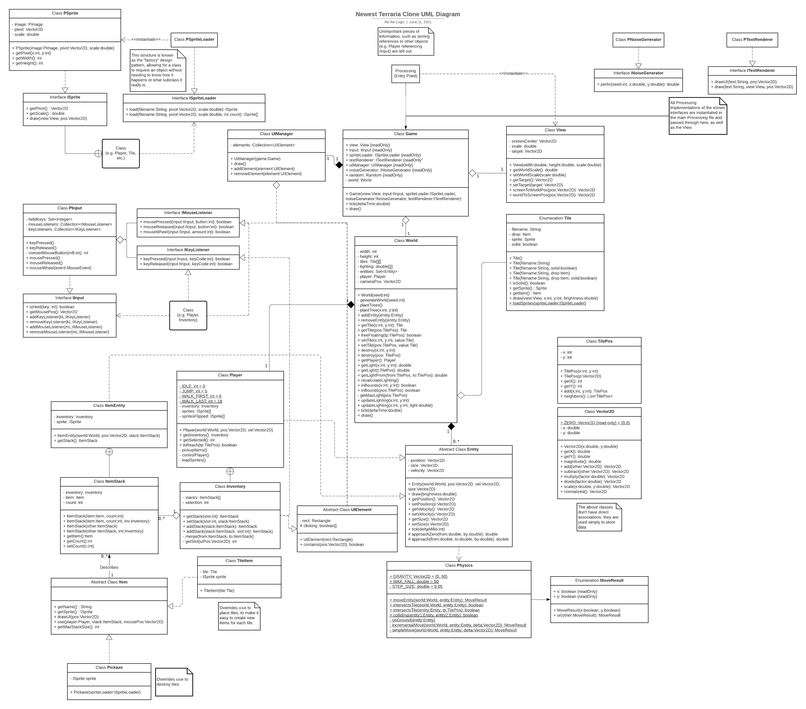
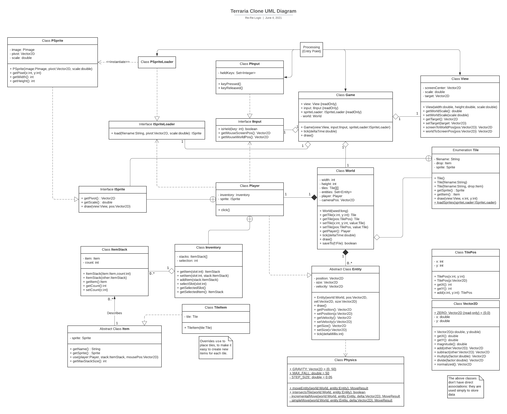

# APCSFinalProject

---

**Group Name:** Re-Re-Logic

**Group Members:** Ivan Mijacika, Yusuf Elsharawy

**Description:**

This is a 2D platformer/sandbox game built with Java and Processing, with core features similar to that of Terraria or Minecraft. You would be able to break and place blocks, while exploring the generated world and using its resources to make it your own. The camera follows the player around to allow for exploration of the large world, with darkness concealing the deep caves.

**Prototype:** [Link to Doc](https://docs.google.com/document/d/1fGk8TCQy_TDWSslN20We0n-Hrf1ZC2wxaPKPVB0kvkg/edit?usp=sharing)

---
## Instructions

### Setup & Execution

#### Via Processing:

In order to run this project, you will need to download [Processing](https://processing.org/download/).
After cloning this repo to your machine:
```bash
git clone https://github.com/ivanmijacika/APCSFinalProject.git
```
you should open `APCSFinalProject.pde` in Processing. Click play, and it should run at a smooth 50+ FPS after a few seconds of loading.

#### Release:
You can alternatively download an executable for Linux or Windows and your architecture from the
[releases page](https://github.com/ivanmijacika/APCSFinalProject/releases).
In order to run any one of these, you will need to have Java installed, unless you are using 64-bit Windows,
in which case you can download the zip with Java embedded.

### Controls

Use A and D to walk left and right, and Space to jump.

Press keys 0-9, or scroll your mouse wheel, to select different items in your hotbar.

Press Esc to open your full inventory, where you can click on stacks of items to move, swap, and merge them.


---

## UML Diagram:
### Most Updated:

### Older Versions:



[Link to Lucidchart](https://lucid.app/lucidchart/be9a82dd-a053-4a9b-a668-78d0fa196f6d/edit?invitationId=inv_59b0790f-cfa2-4bc2-a18a-2e7590836402)

---

## Development Log:

Yusuf Elsharawy:
- 5/25: I finished the UML diagram and added it to `README.md`
- 5/26: I experimented with compatibility between Processing and regular Java. I also implemented most of the `PInput` class.
- 5/27: I decided to split functionality from the `World` class, to a new `View` class, and designed its functionality. Upon realizing that I was diverging far from the UML, I decided to go back to work on it.
- 5/28: I hardly wrote any code today; instead I focused on fixing the UML diagram and cleaning up other branches.
- 5/31: I implemented `PView` (tested) and `Physics` (untested), and cleaned up existing code to make this possible.
  I also redesigned the program to remove the unnecessary `Renderer` class, and move that functionality to `PSprite`,
  replacing `Sprite` and implementing `ISprite`.
- 6/01: I implemented `Game` class, `ISpriteLoader` & `PSpriteLoader`, and `Tile` definition & drawing.
  I also started work on the `Player` class.
- 6/02: I continued work on the `Player` class, focusing on testing & improving the physics with "good-enough" controls.
  I also made minor changes/improvements and added temporary controls for setting tiles to `AIR` and `STONE`.
- 6/03: I cleaned up existing code & a sprite, improved `World` tile rendering, changed `PSprite` draw method, and improved player controls.
  I also fixed/added to the UML diagram to show all changes made.
- 6/06: I worked on improving player movement & physics, then started work on additional `IInput` methods & listeners,
  to lay the groundwork for the UI system.
- 6/07: I continued work on mouse listeners and started to implement the UI system before realizing that I need to go back to the UML.
- 6/08: I finished what was needed for `UIElement` and `UIManager` (so far), and started implementing the `Inventory` class.
  So far it just displays 10 of the `uiButton.png` sprite.
- 6/09: I worked on a whole variety of things, most of which involved adding methods to existing classes to make the item
  system work. I fixed up all `Item`-related classes and `Tile` so that I'd be fully prepared to implement the `Inventory` tomorrow.
- 6/10: I implemented random world generation with trees & grass, added a lighting system, finished the inventory system,
  added a pickaxe item, and so much more refinement and polishing.

Ivan Mijacika:
- 5/25: Re-read the prototype and prepared to start working on the project.
- 5/26: I worked on/completed the `Vector2D` class and the `TilePos` class. I also worked on the `Sprite` class and implemented most of it.
- 5/27: I added new methods (getHeight and getWidth) to the `Sprite` class and I started working on the `Renderer` class.
- 5/31: I continued working on the `Renderer` class by implementing a scale and changing the coordinates to fit the screen's coordinates (instead of the world's coordinates). I also made a small change to a method in the `Sprite` class.
- 6/01: No new commits but I searched for sprites (for tiles and player) and worked on resizing them for use.
- 6/03: I added sprites for Dirt, Grass, and Stone that are used in world generation. I also made changes in the `PSprite` and `PSriteLoader` methods (also in setup) so that int[][] would be replaced with PImage for greater efficiency. I also added to the `Game` class so that the screen follows the player as they move.
- 6/07: I added the classes `ItemStack` and `TileItem`, which will be used in the creation of an inventory system by storing data such as the item, the count of that item, and the sprite of the item.
- 6/08: I added the abstract class `Item`, with two get methods. There are an additional two abstract methods (`getName` and `use`) which can be used by subclasses.
- 6/09: I added the interface `INoiseGenerator` and the class `PNoiseGenerator` that implements it. I then added a new `PNoiseGenerator` object to the main processing file and added the new interface/class to the `Game` constructor. This will all be used to implement perlin noise.
- 6/10: I worked on `ISprite`/`PSprite` and `ISpriteLoader`/`PSpriteLoader`. I added the method drawWithLight to `PSprite`, which is the same as draw but takes into account light/darkness to modify the shade of the colors. In `PSpriteLoader` I added the methods load and flipped, which return an array of PSprites and a flipped PSprite respectively. I also added new sprites for tiles and items.
