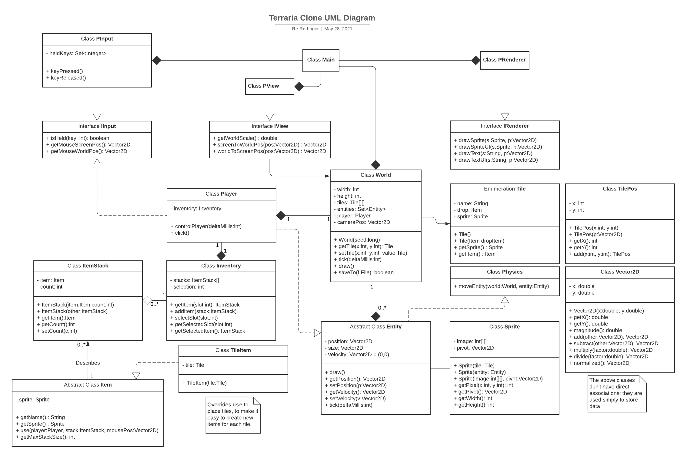
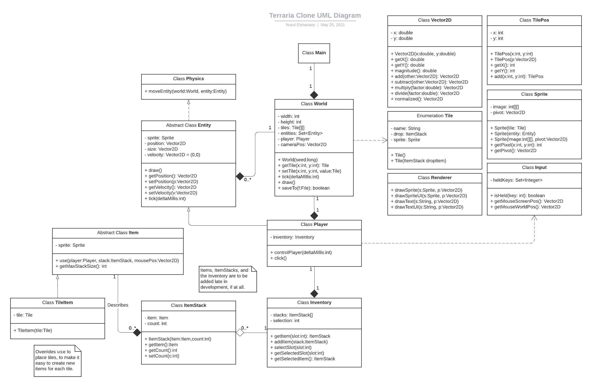

# APCSFinalProject

**Group Name:** Re-Re-Logic

**Group Members:** Ivan Mijacika, Yusuf Elsharawy

**Description:**

This is a 2D platformer/sandbox game built with Java and Processing, with core features similar to that of Terraria or Minecraft. You would be able to break and place blocks, while exploring the generated world and using its resources to make it your own. The camera follows the player around to allow for exploration of the large world, which you can save to a file to continue playing later.

**Prototype:** [Link to Doc](https://docs.google.com/document/d/1fGk8TCQy_TDWSslN20We0n-Hrf1ZC2wxaPKPVB0kvkg/edit?usp=sharing)

**UML Diagram:** (most updated first)

[Link to Lucidchart](https://lucid.app/lucidchart/be9a82dd-a053-4a9b-a668-78d0fa196f6d/edit?invitationId=inv_59b0790f-cfa2-4bc2-a18a-2e7590836402)

**Development Log:**

Yusuf Elsharawy:
- 5/25: I finished the UML diagram and added it to `README.md`
- 5/26: I experimented with compatibility between Processing and regular Java. I also implemented most of the `PInput` class.
- 5/27: I decided to split functionality from the `World` class, to a new `View` class, and designed its functionality. Upon realizing that I was diverging far from the UML, I decided to go back to work on it.

Ivan Mijacika:
- 5/25: 
- 5/26: I worked on/completed the `Vector2D` class and the `TilePos` class. I also worked on the `Sprite` class and implemented most of it.
- 5/27: I added new methods (getHeight and getWidth) to the `Sprite` class and I started working on the `Renderer` class.
